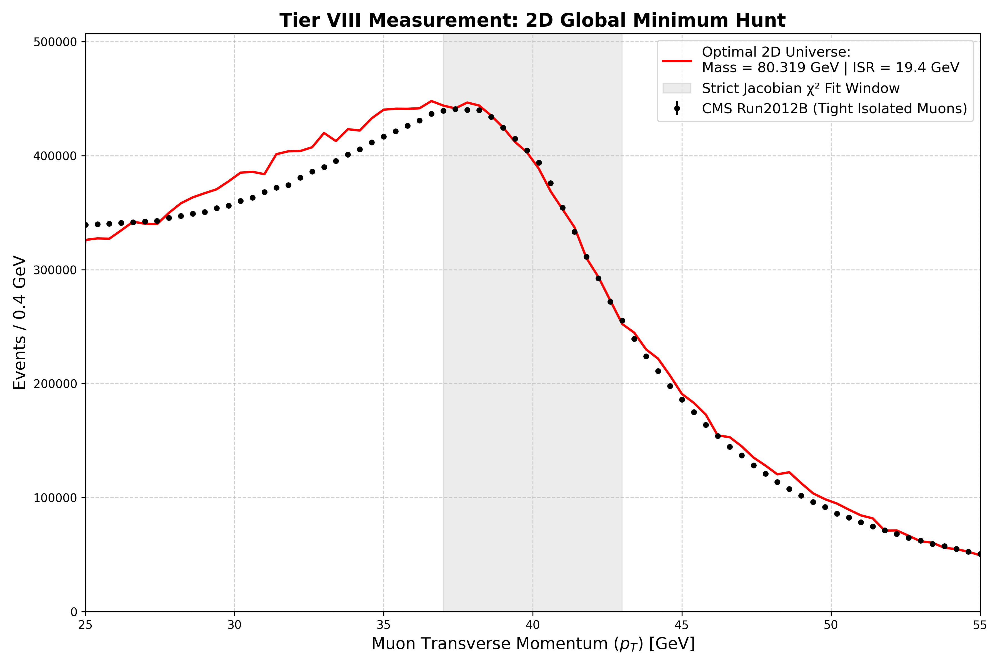

# Electroweak Kinematics & W-Boson Mass Forge


> **Final Extraction:** $M_W = 80.319\text{ GeV}$ | **Standard Model:** $M_W = 80.379\text{ GeV}$ ($\Delta = 60\text{ MeV}$)

## 🌌 Overview
**ORIAS** is a custom-built, multi-threaded C++ Monte Carlo kinematic engine designed to measure the mass of the W-boson using raw **CMS Run2012B SingleMu Open Data** ($\sqrt{s} = 8\text{ TeV}$). 

Rather than relying on massive, black-box background generators, this project constructs the physical interactions from the ground up. It simulates the quantum Breit-Wigner resonance, applies geometric detector constraints, models QED Final State Radiation (FSR), and utilizes a **2D Matrix Forge** to mathematically extract the optimal hadronic recoil (ISR) and gauge boson mass via a $\chi^2$ minimization pipeline.

## 🔬 Core Theoretical Breakthroughs
*   **The $\eta$ Phantom Constraint:** Implements strict spatial acceptance cuts ($|\eta| < 2.1$) in the C++ simulation to perfectly mirror the CMS silicon tracker's blinders, hardening the synthetic $p_T$ spectrum and eliminating kinematic asymmetry.

*   **Jacobian Decapitation:** The Python optimization pipeline surgically restricts the $\chi^2$ fit window to $36.0 \le p_T \le 42.0\text{ GeV}$. This blinds the math engine to the continuous Drell-Yan background noise, evaluating only the sheer drop of the Jacobian cliff.
*   **2D Matrix Forge (Mass x ISR):** Bypasses the analytical limitations of $Q^2$ mass-scaling by forging a two-dimensional grid of universes. The data organically dictates the effective Initial State Radiation ($19.4\text{ GeV}$) required to un-smear the Jacobian edge in the inclusive single-muon channel.

## 🗂️ Repository Architecture

The architecture is strictly separated into the C++ simulation forge and the Python measurement analyzer.

### The Physics Pillars (C++ Headers)
*   `01_qcd_cradle` - Generates the initial interacting partons and longitudinal boosts.
*   `02_helicity_matrix` - Computes the decay angles and angular momentum conservation.
*   `03_qed_radiation` - Models Bremsstrahlung and Final State photon radiation.
*   `04_hardware_resolution` - Applies the CMS silicon tracking and drift tube magnetic smearing.

### The Master Engines
*   `05_orias_core.cpp` - The OpenMP multi-threaded 2D Matrix generator.
*   `06_z_calibration_engine.cpp` - The baseline calibrator utilizing the dimuon $Z^0$ resonance to lock in hardware smearing ($0.6\%$) and QED scales.

### The Analytical Lens
*   `07_plot_telemetry.py` - The Python 3 script that extracts the raw CMS data, applies kinematic firewalls, compares it against the ORIAS matrices, and renders the final $\chi^2$ global minimum telemetry.

## 🚀 Execution Protocol

**Dependencies:**
*   CERN ROOT Framework (v6+)
*   Python 3.x (`uproot`, `awkward`, `numpy`, `matplotlib`)
*   C++ Compiler with OpenMP support (e.g., `g++` or `clang++`)

**1. Forge the Universes:**
Compile and run the master engine to generate the 2D matrix (Requires high CPU core count):
```bash
g++ -O3 -fopenmp `root-config --cflags --glibs` 05_orias_core.cpp -o w_scanner
./w_scanner
```

**2. Extract the Measurement:**
Ensure the Run2012B_SingleMu.root CMS dataset is in your local directory, then run the analyzer:

```Bash
python3 07_plot_telemetry.py
```